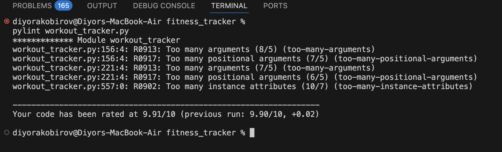
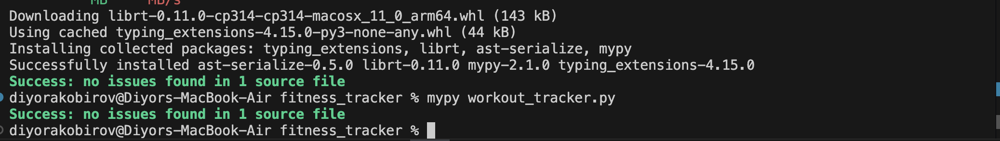

# Fitness Tracker

A full-stack fitness tracking application built with Python OOP, FastAPI, and a vanilla JS frontend. Supports user profiles, AI-generated workouts, session logging with strength and cardio exercises, weight tracking, and persistent JSON storage.

## What It Does

- Create and manage user profiles with fitness level, goal, and available equipment
- Generate personalised workout plans based on profile, equipment, and BMI
- Log workout sessions — strength (sets × reps × weight) and cardio (duration + distance)
- Track body weight over time with BMI calculation and trend monitoring
- Search and filter sessions, browse the full exercise database
- Stats overview showing total sessions, volume (kg), and cardio minutes
- Data persists across server restarts via a JSON file

## Project Structure

```
workout_tracker.py        # OOP core — all classes and business logic
main.py                   # FastAPI backend — HTTP endpoints
index.html                # Frontend — single-page UI served by FastAPI
test_workout_tracker.py   # Pytest test suite (77 tests)
run.py                    # Entry point — starts the server
requirements.txt          # Python dependencies
workouts.json             # Auto-generated data store (git-ignored)
```

## OOP Design

### Class Hierarchy

```
Exercise  (Abstract Base Class)
├── StrengthExercise
└── CardioExercise

UserProfile               (standalone user model with weight history)
WorkoutSession            (container for logged exercises)
WorkoutLog                (CRUD store for sessions and profiles)
WorkoutGenerator          (profile-aware workout planner)
WorkoutTemplate           (generated plan: type + exercise list)
ExerciseTemplate          (blueprint in the exercise database)
WeightEntry               (timestamped body weight measurement)
```

### Encapsulation

All data is stored in private attributes (prefixed `_`). Public access goes through property getters with validated setters that reject invalid data at the point of entry:

```python
@weight_kg.setter
def weight_kg(self, value: float) -> None:
    value = float(value)
    if value < 0:
        raise ValueError("Weight cannot be negative.")
    self._weight_kg = round(value, 2)
```

The `id` field on every class has a getter but no setter — it is read-only after creation:

```python
@property
def id(self) -> str:
    return self._id   # no setter — cannot be changed from outside
```

### Abstraction

`Exercise` inherits from Python's `ABC`. It cannot be instantiated directly — it only defines the contract that `StrengthExercise` and `CardioExercise` must follow:

```python
@abstractmethod
def get_type(self) -> str:
    """Return a string identifying the concrete exercise type."""

@abstractmethod
def get_extra_fields(self) -> dict:
    """Return type-specific fields for serialisation."""
```

If a subclass forgets to implement either method, Python raises a `TypeError` immediately.

### Inheritance

`StrengthExercise` and `CardioExercise` both extend `Exercise`. They inherit all shared logic — field validation, `to_dict()`, `__repr__()` — and only define what makes them different:

```python
class StrengthExercise(Exercise):
    def __init__(self, name, muscle_group, sets, reps, weight_kg, ...):
        super().__init__(name, muscle_group, notes, _id)  # shared setup
        self.sets      = sets                              # strength-only fields
        self.reps      = reps
        self.weight_kg = weight_kg

class CardioExercise(Exercise):
    def __init__(self, name, muscle_group, duration_min, distance_km, ...):
        super().__init__(name, muscle_group, notes, _id)  # shared setup
        self.duration_min = duration_min                   # cardio-only fields
        self.distance_km  = distance_km
```

Neither subclass re-implements name validation, notes stripping, or serialisation — they inherit all of that from `Exercise` via `super()`.

### Polymorphism

`WorkoutSession` stores and operates on `Exercise` objects without caring whether they are strength or cardio. The same method calls produce different output depending on the actual object:

```python
for ex in session.get_all_exercises():
    print(ex.get_type())         # "strength" or "cardio"
    print(ex.get_extra_fields()) # {"sets": ..., "reps": ...} or {"duration_min": ...}
```

`WorkoutSession.total_volume()` and `total_cardio_minutes()` use `isinstance` checks to sum each type correctly without coupling the session logic to subclass internals.

### Workout Generator

`WorkoutGenerator` takes a `UserProfile` and produces a `WorkoutTemplate` by filtering the exercise database against the user's equipment, fitness level, and workout type. Goal modifiers adjust default sets and reps:

| Goal | Sets modifier | Reps modifier |
|---|---|---|
| `strength` | ×1.3 | ×0.7 |
| `muscle_gain` | ×1.0 | ×1.0 |
| `weight_loss` | ×0.9 | ×1.3 |
| `endurance` | ×0.8 | ×1.5 |

BMI category further adjusts the ordering (higher BMI → more cardio prioritised; underweight → more strength) and can add an extra exercise to the set.

### Data Structure

`WorkoutLog` stores sessions and profiles in `dict[str, ...]` keyed by UUID. This gives O(1) lookup, update, and deletion by ID regardless of how many records are stored — faster than searching a list each time.

## API Endpoints

| Method | Path | Description |
|---|---|---|
| GET | `/` | Serves the frontend |
| GET | `/meta/workout-types` | List workout type options |
| GET | `/meta/equipment` | List equipment options |
| GET | `/meta/levels` | List fitness level options |
| GET | `/meta/goals` | List fitness goal options |
| GET | `/meta/muscles` | List muscle group options |
| GET | `/exercises/database` | Browse exercise database (filterable) |
| GET | `/profiles` | List all profiles |
| GET | `/profiles/{id}` | Get a profile by ID |
| POST | `/profiles` | Create a profile |
| PUT | `/profiles/{id}` | Update a profile (partial) |
| DELETE | `/profiles/{id}` | Delete a profile |
| POST | `/profiles/{id}/weight` | Log a body weight entry |
| GET | `/profiles/{id}/weight` | Get full weight history + BMI |
| POST | `/generate` | Generate a workout plan for a profile |
| GET | `/sessions` | List all sessions (optional `?user_id=`) |
| GET | `/sessions/search?q=` | Search sessions by keyword |
| GET | `/sessions/{id}` | Get a session by ID |
| POST | `/sessions` | Create a new session |
| PUT | `/sessions/{id}` | Update a session (partial) |
| DELETE | `/sessions/{id}` | Delete a session |
| POST | `/sessions/{id}/exercises` | Add an exercise to a session |
| DELETE | `/sessions/{id}/exercises/{ex_id}` | Remove an exercise from a session |
| GET | `/stats` | Aggregate stats across all sessions |

Interactive API docs are available at `/docs` when the server is running.

## Running Locally

Requirements: Python 3.11+

Clone the repo:

```bash
git clone https://github.com/Arsene1872007/fitness-tracker.git
cd fitness-tracker
```

Create a virtual environment:

```bash
python -m venv venv
venv\Scripts\activate      # Windows
source venv/bin/activate   # Mac / Linux
```

Install dependencies:

```bash
pip install -r requirements.txt
```

Start the server:

```bash
python run.py
```

Open `http://127.0.0.1:8000` in your browser.

Data is saved to `workouts.json` in the project folder automatically. This file should be excluded from git via `.gitignore`.

## Running the Tests

```bash
python -m pytest test_workout_tracker.py -v
```

77 tests covering:

| Test Class | What It Tests |
|---|---|
| `TestStrengthExercise` | Field validation — empty name, sets/reps/weight bounds, volume calculation, serialisation |
| `TestCardioExercise` | Duration/distance validation, pace calculation, serialisation |
| `TestExerciseIdentity` | UUID uniqueness, read-only ID, equality by ID |
| `TestUserProfile` | Age/level/goal/equipment/height/weight validation, BMI calculation, weight history |
| `TestExerciseTemplate` | `fits()` logic — equipment, level, workout type matching |
| `TestWorkoutGenerator` | Generation by type and level, goal modifiers, BMI adjustments, equipment filtering |
| `TestWorkoutSession` | Add/remove exercises, total volume, cardio minutes, `__contains__`, serialisation |
| `TestWorkoutLogProfiles` | CRUD — add, get, update, delete, list all profiles |
| `TestWorkoutLogSessions` | CRUD — add, get, update, delete, search, filter by user |
| `TestPersistence` | Round-trip save and reload from JSON |
| `TestExerciseDatabase` | Database completeness — exercise count, equipment coverage, all levels represented |

Tests use pytest fixtures (`strength`, `cardio`, `session`, `beginner_profile`, `advanced_profile`, `log`) and `tmp_path` so each test gets its own throwaway file — the real `workouts.json` is never touched.

## Persistence

Data is written to a JSON file after every add, update, or delete. On startup, `WorkoutLog` reads the file and reconstructs all objects.

The file path is configured via the `DATA_FILE` environment variable:

```bash
DATA_FILE=/data/workouts.json python run.py   # production
python run.py                                  # local — defaults to workouts.json
```

## Deploying to Railway

1. Push the repo to GitHub
2. On [railway.app](https://railway.app) → New Project → Deploy from GitHub
3. Click your service → Settings → set Start Command to `python run.py`
4. Click **+ Add** on the canvas → Volume → mount path `/data`
5. Click your service → Variables → add `DATA_FILE = /data/workouts.json`
6. Click your service → Settings → Networking → Generate Domain

Railway injects the `PORT` environment variable automatically. `run.py` reads it:

```python
uvicorn.run("main:app", host="0.0.0.0", port=int(os.environ.get("PORT", 8000)))
```

## Code Quality

Two tools were run against `workout_tracker.py`.

### Pylint — Static Analyser

Pylint reads the code without running it and flags potential problems: missing docstrings, bad naming, logic smells, and style violations. Scores out of 10.



**Score: 9.91/10.** Three warnings were raised, all on data model constructors — a known false positive for this pattern:

| Code | Location | Warning | Explanation |
|---|---|---|---|
| R0913, R0917 | line 156 | Too many arguments (8/5) | `UserProfile.__init__` legitimately needs name, age, level, goal, equipment, workout_days, weight, height. Pylint's default limit is 5. |
| R0913, R0917 | line 221 | Too many arguments (7/5) | `WorkoutSession.__init__` similarly needs multiple fields by design. |
| R0902 | line 557 | Too many instance attributes (10/7) | `WorkoutLog` tracks sessions, profiles, and the data file path — 10 attributes is appropriate for a CRUD store. |

All three would be silenced with `max-args = 10` and `max-attributes = 10` in a `pyproject.toml` config file. No logic errors, no warnings about actual bugs.

### Mypy — Type Checker

Mypy checks that the type annotations throughout the code are consistent — for example, that a function declared to return `str` never returns `None`, or that a method expecting a `float` isn't called with a `str`.



Clean pass. All `Optional[float]`, `Optional[str]`, `list[str]`, and return type annotations across every class were verified as correct and consistent.

## Tech Stack

| Layer | Technology |
|---|---|
| Language | Python 3.11+ |
| Backend | FastAPI |
| Server | Uvicorn |
| Frontend | HTML + CSS + Vanilla JS (no frameworks) |
| Storage | JSON file |
| Testing | pytest with fixtures |
| Hosting | Railway |
